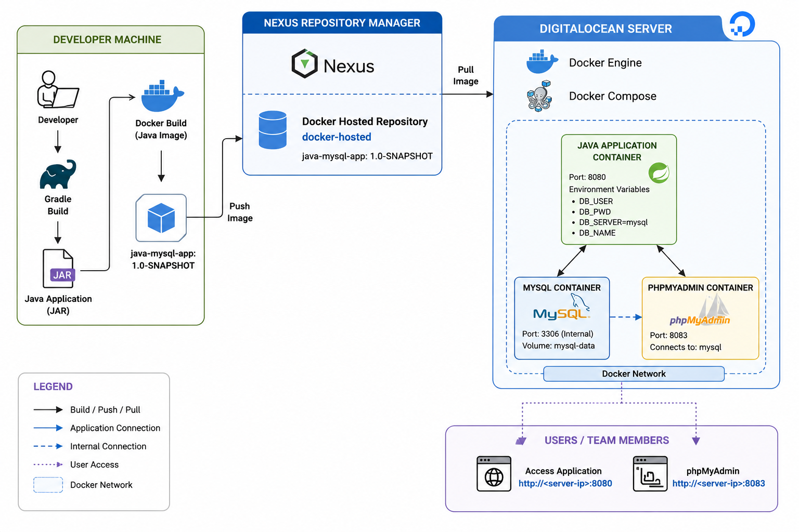
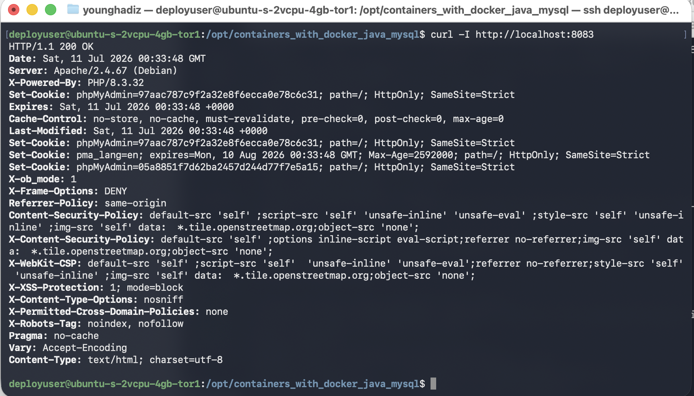
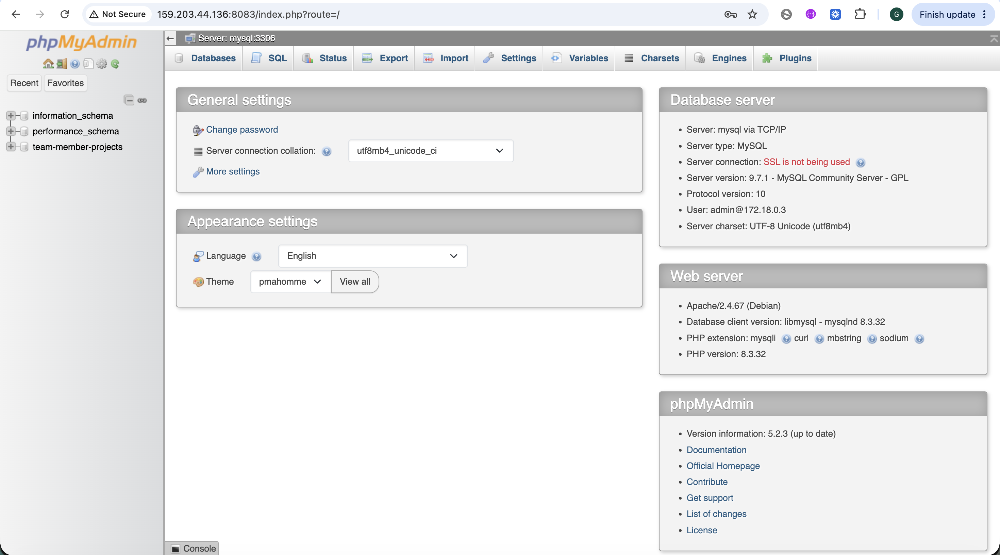
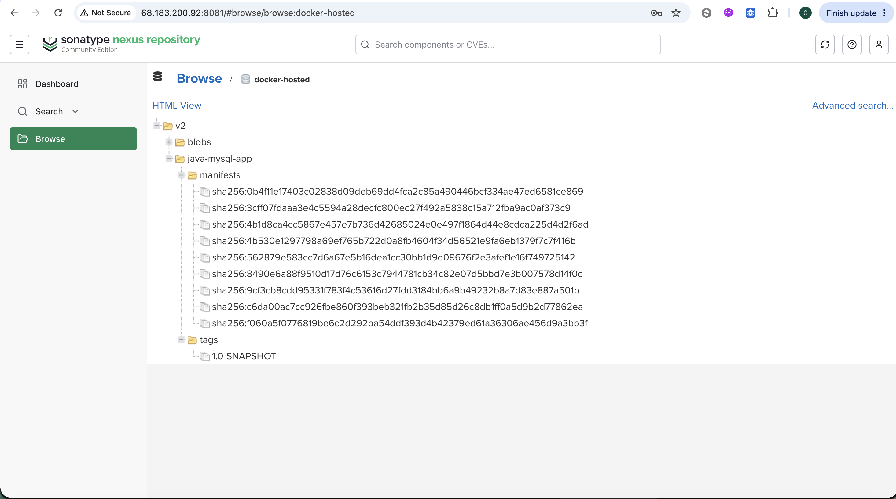
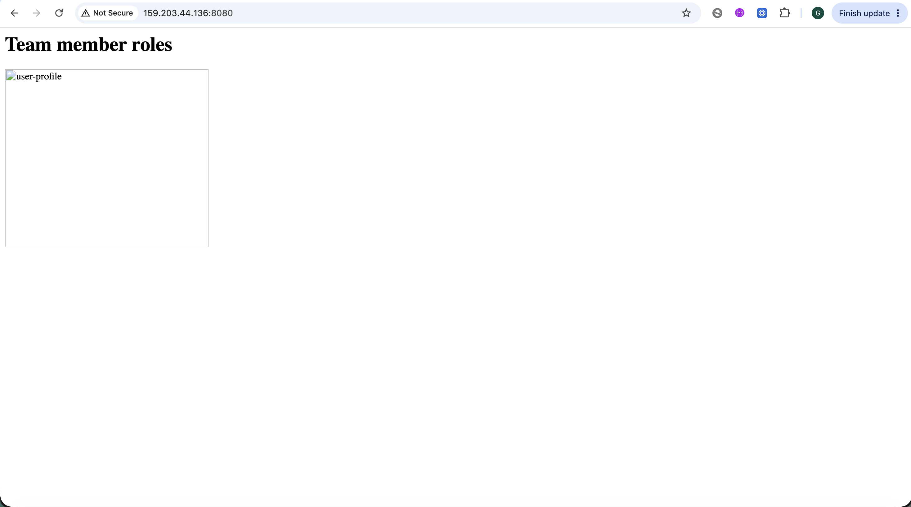

# Containers with Docker — Java Application with MySQL and phpMyAdmin

## Project Overview

This project demonstrates a complete containerized deployment workflow for a Java application backed by MySQL and administered through phpMyAdmin.

The application allows users to view and update team-member information. Updated data is stored in MySQL and preserved through a Docker named volume.

The project was completed as part of the **TechWorld with Nana DevOps Bootcamp — Containers with Docker module** and was expanded into a portfolio-ready implementation using production-oriented DevOps practices.

The project demonstrates:

- Local application and database testing
- Docker container lifecycle management
- Docker Compose orchestration
- Java application containerization
- MySQL data persistence
- MySQL health checks
- Private Docker image storage in Nexus
- Multi-platform Docker image publishing
- DigitalOcean deployment
- Environment-based configuration
- Secure handling of runtime credentials
- Professional Git branching with `develop`, `feature/*`, and `main`
- Merge commits using `git merge --no-ff`

---

## Final Architecture


The diagram below shows the complete containerized deployment workflow, from building the Java application locally to publishing the image in Nexus and running the full stack on a DigitalOcean server with Docker Compose.




## Architecture text structure: 

```text
Developer MacBook
      |
      | 1. Build Java JAR with Gradle
      | 2. Build Docker image
      | 3. Publish image to Nexus
      v
Nexus Repository Manager
Private Docker Hosted Repository
Port 8083
      |
      | Authenticated docker pull
      v
DigitalOcean Ubuntu Application Server
      |
      | docker compose up -d
      v
┌──────────────────────────────────────────────────────┐
│ Docker Compose Network                               │
│                                                      │
│  ┌──────────────────────────────┐                    │
│  │ Java Application            │                    │
│  │ Image pulled from Nexus     │                    │
│  │ Host port: 8080             │                    │
│  │ DB_SERVER=mysql             │                    │
│  └──────────────┬───────────────┘                    │
│                 │ Internal Docker DNS                │
│                 ▼                                    │
│  ┌──────────────────────────────┐                    │
│  │ MySQL Database              │                    │
│  │ Internal port: 3306         │                    │
│  │ No public host exposure     │                    │
│  │ Named volume: mysql-data    │                    │
│  └──────────────┬───────────────┘                    │
│                 │                                    │
│                 ▼                                    │
│  ┌──────────────────────────────┐                    │
│  │ phpMyAdmin                  │                    │
│  │ Host port: 8083             │                    │
│  │ Restricted by firewall      │                    │
│  └──────────────────────────────┘                    │
└──────────────────────────────────────────────────────┘
      |
      v
Browser Access

Java application:
http://YOUR_APPLICATION_SERVER_IP:8080

phpMyAdmin:
http://YOUR_APPLICATION_SERVER_IP:8083
```

> Public IP addresses, credentials, and tokens are intentionally excluded from this repository.

---

## Deployment Evidence

### Java Application Running on DigitalOcean

The Java application is deployed as a Docker container and published through port `8080`.



---

### phpMyAdmin Connected to MySQL

phpMyAdmin is running as a separate container and connects to MySQL through the internal Docker Compose network using the service name `mysql`.



---

### Docker Image Stored in Nexus

The Java application image was built locally, tagged for the Nexus Docker registry, and published to the private `docker-hosted` repository.



---

### Deployment Validation from the Server

The deployment server successfully returned an HTTP `200 OK` response from phpMyAdmin, confirming that the container and port mapping were working.




---

## Repository Structure

```text
containers_with_docker_java_mysql/
├── .gitignore
├── Dockerfile
├── README.md
├── build.gradle
├── docker-compose.yaml
├── docker-compose-with-app.yaml
├── settings.gradle
├── docs/
│   ├── architecture/
│   └── screenshots/
│       ├── application-server.png
│       ├── deployment-successful.png
│       ├── nexus-docker-hosted.png
│       └── phpmyadmin.png
├── scripts/
│   └── server-install-docker.sh
└── src/
    ├── main/
    │   ├── java/
    │   └── resources/
    │       └── static/
    └── test/
```

---

## Technologies Used

- Java
- Gradle
- Docker
- Docker Buildx
- Docker Compose
- MySQL
- phpMyAdmin
- Nexus Repository Manager
- DigitalOcean Droplets
- Ubuntu 24.04 LTS
- Git
- GitHub
- GitLab
- Bash
- Linux system administration

---

## Git Workflow

This project uses the following branch model:

```text
main
develop
feature/*
fix/*
docs/*
```

Development workflow:

```text
feature branch
      |
      | commit and test
      v
develop
      |
      | git merge --no-ff
      v
main
```

Example:

```bash
git checkout develop

git checkout -b feature/mysql-phpmyadmin-compose

git add .

git commit -m "feat: orchestrate MySQL and phpMyAdmin with Docker Compose"

git checkout develop

git merge --no-ff feature/mysql-phpmyadmin-compose \
  -m "merge: add MySQL and phpMyAdmin Compose configuration"
```

Using `--no-ff` preserves the feature branch history and makes the Git graph easier to review.

---

## Environment Variables

The application and supporting containers use environment variables instead of hardcoded credentials.

Required variables:

```text
DOCKER_REGISTRY
DB_USER
DB_PWD
DB_SERVER
DB_NAME
MYSQL_ROOT_PASSWORD
PMA_HOST
PMA_PORT
```

These values are environment-dependent and should not be committed to source control.

Example server-only `.env` file:

```env
DOCKER_REGISTRY=YOUR_NEXUS_SERVER_IP:8083
DB_USER=admin
DB_PWD=CHANGE_ME
DB_SERVER=mysql
DB_NAME=team-member-projects
MYSQL_ROOT_PASSWORD=CHANGE_ME
PMA_HOST=mysql
PMA_PORT=3306
```

Secure the file:

```bash
chmod 600 .env
```

The `.env` file must remain excluded through `.gitignore`.

---

## Local Development

### Start MySQL Locally

```bash
docker run \
  --name mysql \
  -p 3306:3306 \
  -e MYSQL_ROOT_PASSWORD=rootpass \
  -e MYSQL_DATABASE=team-member-projects \
  -e MYSQL_USER=admin \
  -e MYSQL_PASSWORD=adminpass \
  -d mysql
```

> Demo passwords are acceptable only for local testing. Use strong unique values for remote environments.

---

### Start phpMyAdmin Locally

```bash
docker run \
  --name phpmyadmin \
  -p 8083:80 \
  --link mysql:db \
  -d phpmyadmin/phpmyadmin
```

Access:

```text
http://localhost:8083
```

---

## Docker Compose for MySQL and phpMyAdmin

Start both services:

```bash
docker compose -f docker-compose.yaml up -d
```

Check status:

```bash
docker compose -f docker-compose.yaml ps
```

Stop the services:

```bash
docker compose -f docker-compose.yaml down
```

The MySQL data volume is retained unless the volume is explicitly removed.

---

## Build the Java Application

```bash
gradle clean build
```

Expected JAR location:

```text
build/libs/
```

---

## Build the Docker Image

Build a local image:

```bash
docker build \
  -t java-mysql-app:1.0-SNAPSHOT \
  .
```

Verify:

```bash
docker images | grep java-mysql-app
```

---

## Publish the Image to Nexus

### Log in to Nexus

```bash
docker login YOUR_NEXUS_SERVER_IP:8083
```

### Tag the Image

```bash
docker tag \
  java-mysql-app:1.0-SNAPSHOT \
  YOUR_NEXUS_SERVER_IP:8083/java-mysql-app:1.0-SNAPSHOT
```

### Push the Image

```bash
docker push \
  YOUR_NEXUS_SERVER_IP:8083/java-mysql-app:1.0-SNAPSHOT
```

---

## Multi-Platform Image Build

The local MacBook uses Apple Silicon, while the DigitalOcean server uses `linux/amd64`.

To avoid an architecture mismatch, the image can be built and pushed for multiple platforms:

```bash
docker buildx build \
  --platform linux/amd64,linux/arm64 \
  --tag YOUR_NEXUS_SERVER_IP:8083/java-mysql-app:1.0-SNAPSHOT \
  --push \
  .
```

This allows Docker to select the correct image variant automatically.

---

## DigitalOcean Server Preparation

The project uses a separate DigitalOcean Droplet for the application stack.

Recommended configuration:

```text
Ubuntu 24.04 LTS
2 vCPU
4 GB RAM
SSH key authentication
Monitoring enabled
```

Recommended inbound firewall rules:

```text
TCP 22   → trusted administrator IP only
TCP 8080 → trusted users or public access for the demo
TCP 8083 → administrator IP only
TCP 3306 → not exposed publicly
```

MySQL is accessed only through the internal Docker Compose network.

---

## Install Docker on the Server

The repository includes:

```text
scripts/server-install-docker.sh
```

Run:

```bash
bash scripts/server-install-docker.sh
```

After the script adds the deployment user to the Docker group, log out and reconnect.

Validate:

```bash
docker --version
docker compose version
docker run --rm hello-world
```

---

## Configure the Nexus Registry on the Server

Because the lab Nexus registry uses HTTP, the Docker daemon must explicitly allow it.

Create:

```text
/etc/docker/daemon.json
```

Content:

```json
{
  "insecure-registries": [
    "YOUR_NEXUS_SERVER_IP:8083"
  ]
}
```

Restart Docker:

```bash
sudo systemctl restart docker
```

Verify:

```bash
docker info
```

Expected section:

```text
Insecure Registries:
  YOUR_NEXUS_SERVER_IP:8083
```

Authenticate:

```bash
docker login YOUR_NEXUS_SERVER_IP:8083
```

---

## Deploy the Full Stack

Move into the cloned repository:

```bash
cd /opt/containers_with_docker_java_mysql
```

Validate the Compose services:

```bash
docker compose \
  --env-file .env \
  -f docker-compose-with-app.yaml \
  config --services
```

Pull the required images:

```bash
docker compose \
  --env-file .env \
  -f docker-compose-with-app.yaml \
  pull
```

Start the complete stack:

```bash
docker compose \
  --env-file .env \
  -f docker-compose-with-app.yaml \
  up -d
```

---

## Validation Commands

### Check All Containers

```bash
docker compose \
  --env-file .env \
  -f docker-compose-with-app.yaml \
  ps
```

Or:

```bash
docker ps
```

Expected running services:

```text
mysql
phpmyadmin
my-java-app
```

---

### Check MySQL Logs

```bash
docker compose \
  --env-file .env \
  -f docker-compose-with-app.yaml \
  logs --tail=100 mysql
```

Expected message:

```text
ready for connections
```

---

### Check Java Application Logs

```bash
docker compose \
  --env-file .env \
  -f docker-compose-with-app.yaml \
  logs --tail=100 my-java-app
```

---

### Check phpMyAdmin Logs

```bash
docker compose \
  --env-file .env \
  -f docker-compose-with-app.yaml \
  logs --tail=100 phpmyadmin
```

---

### Test the Java Application Locally on the Server

```bash
curl -i http://localhost:8080
```

Expected:

```text
HTTP/1.1 200
```

---

### Test phpMyAdmin Locally on the Server

```bash
curl -I http://localhost:8083
```

Expected:

```text
HTTP/1.1 200 OK
```

---

## Data Persistence

MySQL uses a Docker named volume.

Check volumes:

```bash
docker volume ls
```

The data remains available when containers are stopped and recreated.

Stop the stack without deleting data:

```bash
docker compose \
  --env-file .env \
  -f docker-compose-with-app.yaml \
  down
```

Start it again:

```bash
docker compose \
  --env-file .env \
  -f docker-compose-with-app.yaml \
  up -d
```

Do not use `down -v` unless you intentionally want to delete the database data.

---

## Security Controls

The project applies the following security practices:

- Credentials are supplied through environment variables.
- `.env` is excluded from Git.
- `.env` permissions are restricted with `chmod 600`.
- MySQL port `3306` is not exposed publicly.
- phpMyAdmin access is restricted through the DigitalOcean firewall.
- SSH access is restricted to trusted IP addresses.
- SSH key authentication is preferred over passwords.
- Nexus uses a dedicated repository user.
- The deployment server uses a non-root deployment user.
- Docker images are stored in a private Nexus repository.
- Sensitive data is excluded from screenshots and documentation.

Do not commit or expose:

```text
.env
database passwords
Nexus credentials
Docker registry credentials
~/.docker/config.json
SSH private keys
DigitalOcean API tokens
GitHub tokens
GitLab tokens
billing information
```

---

## Production Improvements

The current project is suitable for a bootcamp capstone and portfolio demonstration.

Recommended production improvements include:

- Configure HTTPS for the application and Nexus registry.
- Place Nginx or another reverse proxy in front of the services.
- Use a trusted TLS certificate.
- Remove direct public access to phpMyAdmin.
- Access phpMyAdmin through VPN, SSH tunnelling, or a private network.
- Use immutable Docker image tags instead of reusing snapshot tags.
- Use a dedicated read-only Nexus deployment account.
- Use a secrets manager instead of a local `.env` file.
- Add container resource limits.
- Add automated backups for the MySQL volume.
- Add centralized logging and monitoring.
- Add CI/CD automation for image build, scan, push, and deployment.
- Add vulnerability scanning with Docker Scout or Trivy.
- Pin Docker image versions instead of using floating `latest` tags.

---

## Troubleshooting

### Container Name Already Exists

```bash
docker rm -f mysql
```

```bash
docker rm -f phpmyadmin
```

Remove only containers that belong to this project.

---

### Application Cannot Connect to MySQL

Check application logs:

```bash
docker compose \
  --env-file .env \
  -f docker-compose-with-app.yaml \
  logs --tail=200 my-java-app
```

Confirm:

```env
DB_SERVER=mysql
```

Do not use:

```env
DB_SERVER=localhost
```

Inside the Java container, `localhost` refers to the Java container itself.

---

### MySQL Is Not Ready Before the Application Starts

The Compose file should include a MySQL health check and a dependency condition:

```yaml
my-java-app:
  depends_on:
    mysql:
      condition: service_healthy
```

Example MySQL health check:

```yaml
mysql:
  healthcheck:
    test:
      [
        "CMD-SHELL",
        "mysqladmin ping -h localhost -u root -p$$MYSQL_ROOT_PASSWORD"
      ]
    interval: 10s
    timeout: 5s
    retries: 10
    start_period: 30s
```

---

### Docker Cannot Pull from Nexus

Verify the registry:

```bash
docker info
```

Confirm authentication:

```bash
docker login YOUR_NEXUS_SERVER_IP:8083
```

Test the registry endpoint:

```bash
curl -I http://YOUR_NEXUS_SERVER_IP:8083/v2/
```

A `401 Unauthorized` response confirms that the registry is reachable and waiting for authentication.

---

### No Matching Manifest for `linux/amd64`

Build and push the image for the correct platform:

```bash
docker buildx build \
  --platform linux/amd64,linux/arm64 \
  --tag YOUR_NEXUS_SERVER_IP:8083/java-mysql-app:1.0-SNAPSHOT \
  --push \
  .
```

---

### Browser Cannot Access the Application

Confirm the container port mapping:

```bash
docker ps
```

Test locally on the server:

```bash
curl -I http://localhost:8080
```

Then check:

```text
DigitalOcean
→ Networking
→ Firewalls
→ TCP 8080
```

---

### phpMyAdmin Cannot Connect to MySQL

Confirm:

```env
PMA_HOST=mysql
PMA_PORT=3306
```

Check logs:

```bash
docker compose \
  --env-file .env \
  -f docker-compose-with-app.yaml \
  logs --tail=200 phpmyadmin
```

---

## Evidence Checklist

Recommended screenshot files:

```text
docs/screenshots/
├── application-server.png
├── deployment-successful.png
├── nexus-docker-hosted.png
├── phpmyadmin.png
```

Before publishing screenshots, hide:

- Public IP addresses
- Personal email addresses
- Passwords
- Tokens
- Billing information
- Private SSH key details
- Registry authentication data

---

## Skills Demonstrated

- Docker image management
- Docker container lifecycle management
- Docker Compose orchestration
- Java application containerization
- MySQL containerization
- phpMyAdmin deployment
- Docker named volumes
- Docker health checks
- Multi-platform image builds
- Private image registry administration
- Nexus Repository Manager
- DigitalOcean cloud deployment
- Linux server administration
- Secure environment-variable handling
- Firewall configuration
- GitHub and GitLab repository management
- Feature-branch Git workflow
- `git merge --no-ff`
- Deployment troubleshooting
- Container networking and service discovery

---

## Project Outcome

The final solution successfully:

- Builds the Java application with Gradle.
- Packages the application into a Docker image.
- Publishes the image to a private Nexus Docker repository.
- Pulls the correct architecture image onto a DigitalOcean server.
- Runs Java, MySQL, and phpMyAdmin through Docker Compose.
- Persists MySQL data using a named volume.
- Uses health checks to control startup order.
- Provides browser access to the application and phpMyAdmin.
- Keeps MySQL private within the Docker network.
- Keeps credentials outside the Git repository.

---

DevOps Engineer | AWS | Docker | Kubernetes | Jenkins | Terraform | Ansible | Prometheus | Grafana